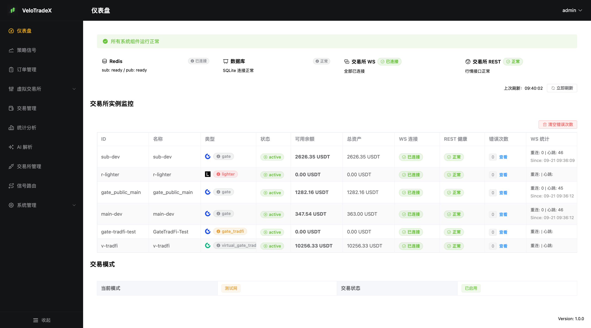
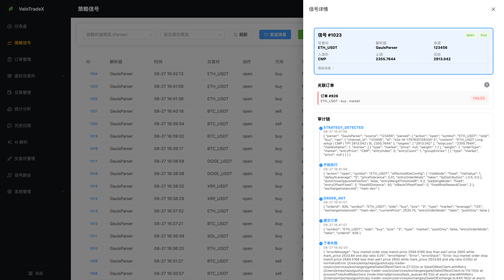
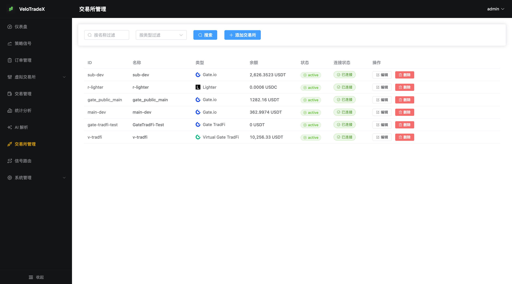
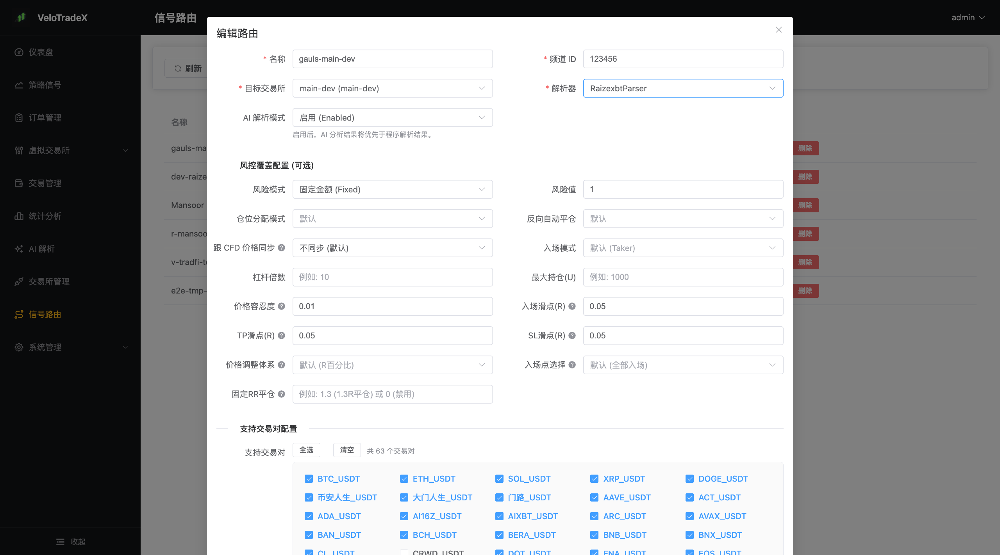
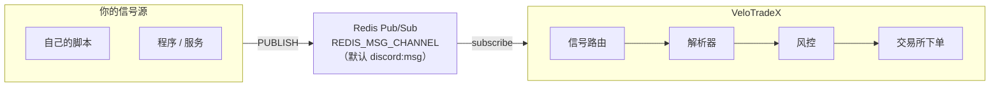

# VeloTradeX — 自动跟单系统

基于 Node.js + TypeScript 的自动跟单系统，监听 Redis 消息队列中的交易信号，通过插件化解析器提取策略，并在多种交易所（Gate.io 永续、Gate TradFi / CFD、Lighter，或本地虚拟交易所）自动执行下单。内置 Vue 3 管理面板，一个镜像即可跑起后端 + 面板 + Redis。

> ⚠️ **风险提示**：本项目仅作为技术工具，**不构成任何投资建议**。自动交易风险极高，
> 可能导致本金全部损失，模拟盘表现不代表真实盘结果。
> 请在使用前完整阅读 [免责声明 / DISCLAIMER](DISCLAIMER.md)，特别是关于**信号来源合法合规性**的说明。

## 一、功能特性

- **插件化解析器**：内置 7 个解析器（Raizexbt、AlwaysWin 经长期实盘验证；Kacang 为程序化黄金解析；WWG、Gauls、Mansoor 待长期验证），支持路由级配置风控参数；解析器统一实现 `IStrategyParser` 接口，扩展新交易员/新信号格式时只需新增解析器并注册，无需改动执行与风控主流程
- **多交易所支持**：Gate.io 永续合约、Gate TradFi（CFD 差价合约）、Lighter，以及本地虚拟交易所（Virtual Gate / Virtual Gate TradFi），详见[支持的交易所](#二支持的交易所)
- **多账户 + 路由**：同时管理多个交易所账户，灵活配置信号源到交易所的路由规则、交易对白名单、杠杆/止盈止损滑点等
- **混合模式执行**：WebSocket (毫秒级) + REST API (稳定止损止盈) 双通道
- **虚拟交易所**：支持 `virtual_gate` / `virtual_gate_tradfi` 实例，用真实行情驱动本地撮合、仓位、盈亏闭环，无需真实资金与 API Key，便于长期模拟跟单
- **风控闭环**：防反向开仓、仓位校验、手动干预识别、杠杆同步阻塞校验、多止盈级处理
- **AI 智能解析**：兼容 OpenAI 接口（DeepSeek 等），**同时支持结构化与非结构化数据**：既能对**纯图片策略**做视觉 AI 识别，也能对自然语言/**语义化指令**做理解解析；支持路由级 AI 模式：禁用 / 仅分析 / 启用覆盖
- **全链路追踪**：Trace ID 日志 + 策略-订单-审计三级关联查询，**支持人工核对**——可回溯「原始信号 → 解析结果 → 下单/持仓」，便于逐笔比对与事后审计
- **Web 管理面板**：仪表盘、策略信号、订单/持仓、交易所/路由、用户权限、审计日志、Webhook 通知、备份恢复、系统日志

### 技术栈

| 层     | 技术                                                                                  |
| ------ | ------------------------------------------------------------------------------------- |
| 后端   | Node.js 20+ / TypeScript / Koa / Sequelize / SQLite / Redis / ioredis / JWT           |
| 交易所 | Gate.io 永续 (WS + REST) / Gate TradFi (CFD) / Lighter / Virtual Gate 系列 (本地撮合) |
| 前端   | Vue 3 / TypeScript / Vite / Element Plus / Pinia / Axios                              |
| 测试   | Jest (单元 + E2E)                                                                     |

### 界面预览

<details>
<summary>点击展开 / 收起（4 张界面截图）</summary>

| 仪表盘 | 策略信号 |
| :---: | :---: |
|  |  |
| **交易所管理** | **信号路由** |
|  |  |

</details>

---

## 二、支持的交易所

系统通过「交易所实例」的 `type` 字段区分交易所实现（见 `src/services/exchanges/ExchangeInstanceManager.ts`）。
每个实例可以独立配置凭据、代理与状态，路由再把信号指向某个实例。

| `type`                           | 交易所 / 产品线                   | 品种                  | 下单通道              | 说明                                                                                                                                                                                    |
| -------------------------------- | --------------------------------- | --------------------- | --------------------- | --------------------------------------------------------------------------------------------------------------------------------------------------------------------------------------- |
| `gate`                           | **Gate.io 永续合约**              | USDT 本位永续（加密） | 私有 WebSocket + REST | 主流加密合约，支持 `testnet` / `real`；WS 负责毫秒级开仓，REST 负责稳定的止盈止损                                                                                                       |
| `gate_tradfi`（别名 `gate_cfd`） | **Gate TradFi（CFD 差价合约）**   | 黄金、指数等传统品种  | REST 轮询             | MT5「一单一仓」模型：一个仓位只有一个 TP + 一个 SL；多档止盈按**分腿建仓**（N 个 TP → N 个独立仓位，任一腿失败则全回滚）。无私有 WS，成交/持仓靠 REST 轮询；公共行情走 `tradfi.tickers` |
| `lighter`                        | **Lighter**                       | zk L2 永续 DEX        | REST + 本地签名       | 需要 `accountIndex` / `apiKeyIndex` / `privateKey`，并在宿主机编译 Go 签名工具挂载进容器（见 [docker/README.md](docker/README.md#八关于-lighter-签名工具go-二进制)）                    |
| `virtual_gate`                   | **Virtual Gate（模拟盘）**        | 同 Gate.io 永续       | 本地撮合              | 用 Gate 真实行情驱动本地撮合引擎，虚拟账户 / 持仓 / 成交 / 盈亏全闭环                                                                                                                   |
| `virtual_gate_tradfi`            | **Virtual Gate TradFi（模拟盘）** | 同 Gate TradFi        | 本地撮合              | 行情与品种来自 Gate TradFi 公共 WS，品种表读取 `dict/gate_cfd_symbols.json`，其余撮合逻辑继承 `virtual_gate`                                                                            |

> **关于 `gate_tradfi` 与 `gate_cfd`**：两者是同一个实现的别名，面板使用 `gate_tradfi`，
> 代码内部也会识别 `gate_cfd`。Gate TradFi 的杠杆由交易所固定（API 不可调）、有交易时段
> （周末休市），并存在隔夜费与强平线，使用前请确认品种规则。
>
> **关于 Binance**：管理面板的类型选择里保留了 Binance 图标，但**后端尚未实现**该适配器，
> 选择后实例不会被注册。目前请只使用上表列出的类型。

### 虚拟交易所（模拟盘）简介

虚拟交易所是本项目内置的**本地撮合模拟盘**，用于在不投入真实资金、不配置 API Key 的情况下
长期验证解析器、路由与风控配置：

- **行情真实、成交虚拟**：行情来自真实交易所（`virtual_gate` 用 Gate.io 永续，
  `virtual_gate_tradfi` 用 Gate TradFi），撮合、仓位与盈亏在本地数据库中计算。
- **完整交易闭环**：支持市价/限价开仓、止盈止损触发、部分平仓、方向反手等，和实盘走同一套
  执行与风控管线，便于对比。
- **常用参数**：`initialBalance`（虚拟初始资金，默认 `10000` USDT）、`maxTickAgeMs`
  （行情最大允许延迟，默认 `10000` ms，超过则视为行情过期不开仓）。
- **局限性**：模拟撮合按行情价格成交，**不模拟真实盘口深度、滑点与手续费**（成交手续费按 0 计），
  因此模拟盈亏优于真实盘的概率较大，不能作为实盘收益预期。

> 建议新用户先用 `virtual_gate` 跑通「信号 → 解析 → 路由 → 下单 → 持仓/盈亏」全流程，
> 再切换到 `testnet`，最后才用 `real`。

---

## 三、内置解析器

解析器按解析方式分为三类：**程序文本解析**（无 AI）、**AI 文本解析**、**AI 图片识别**（视觉）。
同一个 `channel_id` 的消息由路由上指定的解析器处理。当前共注册 **7 个**解析器：

| 解析器            | 解析方式          | 状态                 | 说明                                                                                                             |
| ----------------- | ----------------- | -------------------- | ---------------------------------------------------------------------------------------------------------------- |
| `DefaultParser`   | 程序文本          | 稳定                 | 兜底解析器，识别最通用的 `symbol / side / entry / targets / stopLoss` 字段                                       |
| `AlwaysWinParser` | 程序文本          | ✅ 长期实盘验证      | 针对固定模板文本；内置消息去重与「编辑重发」识别                                                                 |
| `RaizexbtParser`  | AI 文本 + AI 视觉 | ✅ 长期实盘验证      | 核心解析器：**有图片走视觉、无图片走文本**；支持编辑检测与上下文窗口                                             |
| `KacangParser`    | 程序文本          | 程序解析（黄金专用） | 解析 XAUUSD 开仓信号：入场区间 + TP1/TP2 + SL，支持双层入场（L1 市价 + L2 限价）与截断信号均值反推；附带回测工具 |
| `WWGParser`       | AI 文本           | ⚠️ 未长期测试        | 以 `embeds[].description` 作为快照，结合「上一版快照 + 差异规则」交给 LLM                                        |
| `GaulsParser`     | AI 文本           | ⚠️ 未长期测试        | 优先要求 strict JSON schema，失败时降级为宽松 `json_object`                                                      |
| `MansoorParser`   | AI 文本 + AI 视觉 | ⚠️ 未长期测试        | 文本优先（正则确定性解析），少数图片信号走视觉模型兜底                                                           |

> `GET /api/parsers` 可获取运行时的最新注册列表。
> 三类解析方式的原理、各自优缺点与典型示例，详见 [信号接入与解析](docs/signal-input.md)。
> 解析器示例消息（全部为人工虚构数据）见 [`examples/`](examples/)。

**程序文本解析**（`DefaultParser` / `AlwaysWinParser` / `KacangParser`）：零外部依赖、零 API 成本、
毫秒级、结果可复现；缺点是只认预设格式，信号源改文案就可能失效。

**AI 文本解析**（`WWGParser` / `GaulsParser`）：容忍自然语言、措辞变化与多语言；需要先在
管理面板「AI 解析」配置 OpenAI 兼容接口（`provider` / `apiKey` / `baseUrl` / `textModel`），
有延迟与费用，结果存在不确定性。

**AI 图片识别**（`RaizexbtParser` / `MansoorParser`）：部分信号源把入场/止盈/止损画在图表截图里，
系统会先尝试确定性文本快路径，未命中再下载图片并提交 `visionModel`；需要配置视觉模型与图片代理。

> **路由级 AI 增强 `aiMode`**：对自身不具备 AI 能力的解析器，可在路由上叠加
> `disabled`（默认）/ `analyze_only`（只分析记录）/ `enabled`（覆盖解析结果）。
> 已内置 AI 的解析器（`RaizexbtParser`、`AlwaysWinParser`、`WWGParser`、`GaulsParser`、`MansoorParser`）
> 不受 `aiMode` 影响。

---

## 四、如何启动

**不需要本地编译代码**。官方已发布构建好的 Docker 镜像（内含后端 + 管理面板 + 自动迁移），
只要机器上有 Docker，就能跑起来。

### 方式零：一条命令直接拉镜像启动

如果你**已经有 Redis**（比如宿主机或云上已有 `6379`），可以完全不写 compose，
直接拉镜像、跑迁移、起服务：

```bash
docker run -d --name velotradex -p 3000:3000 \
  -e SERVER_JWT_SECRET="$(openssl rand -hex 32)" \
  -e ADMIN_DEFAULT_PASSWORD='改成你的管理员密码' \
  -e SERVER_PORT=3000 \
  -e REDIS_HOST=你的Redis地址 \
  -e REDIS_PORT=6379 \
  -v "$PWD/data:/app/data" \
  --add-host=host.docker.internal:host-gateway \
  ghcr.io/velotradex/velotradex:latest \
  sh -c "npx sequelize-cli db:migrate && node dist/app.js"
```

打开 <http://localhost:3000/velotradex/> 即可。
Redis 在宿主机上时，`REDIS_HOST` 可填 `host.docker.internal`。

> 用 Release 离线包时，把上面的镜像名换成 `velotradex:v1.0.0` 即可
> （先执行 `./scripts/docker-install-from-release.sh v1.0.0` 完成载入）。

### 方式一：一键启动脚本（quickstart.sh）

克隆仓库后，执行一键脚本即可（自动生成安全密钥、拉取镜像、启动 Redis + 迁移 + 服务）：

```bash
git clone https://github.com/VeloTradeX/velotradex.git
cd velotradex
./scripts/quickstart.sh
```

脚本结束后会直接打印管理面板地址与 `admin` 初始密码。可选参数：

```bash
./scripts/quickstart.sh --tag 1.0.0       # 固定 GHCR 镜像版本
./scripts/quickstart.sh --release v1.0.0  # 无法访问 ghcr.io 时，用 GitHub Release 离线包
./scripts/quickstart.sh --no-start        # 只准备 .env，不启动
```

> 一键脚本会**自动把 `SERVER_JWT_SECRET`、`SERVER_ENCRYPTION_KEY`、
> `ADMIN_DEFAULT_PASSWORD` 写入 `.env`**，重复执行不会覆盖已填写的值。

### 方式二：预编译镜像 + Docker Compose

适合需要自己微调 `.env`、或想理解每一步细节的用户。一条命令拉起 **Redis + 数据库迁移 + 后端 + 管理面板**：

```bash
# 1) 准备配置（首次执行；至少设置 SERVER_JWT_SECRET 与 ADMIN_DEFAULT_PASSWORD）
cp .env.example .env
#    生成一个随机密钥填到 .env 的 SERVER_JWT_SECRET：
#    openssl rand -hex 32

# 2) 拉取并启动（不会在本地构建镜像）
docker compose -f docker-compose.release.yml up -d

# 3) 查看状态，等待 app 变为 healthy
docker compose -f docker-compose.release.yml ps
```

启动流程会自动完成：`redis`（healthy）→ `migrate`（自动执行数据库迁移）→ `app`。
**数据库迁移无需手工执行。**

访问 <http://localhost:3000/velotradex/>（访问 `/` 会自动跳转过去）。
默认管理员账号：用户名 `admin`，密码为 `.env` 中 `ADMIN_DEFAULT_PASSWORD` 的值。

> 想固定版本而不是每次用 `latest`：`VTX_TAG=1.0.0 docker compose -f docker-compose.release.yml up -d`
> （注意：**GHCR 上的 semver tag 不带 `v`**，是 `1.0.0`；而 Release 离线包载入后的镜像名是 `velotradex:v1.0.0`）
>
> **拉取不到时（`pull access denied` / `401` / `403` / 网络不通）**，用官方 Release 的离线包，
> 它不依赖任何镜像仓库、也不需要登录：
>
> ```bash
> ./scripts/docker-install-from-release.sh v1.0.0    # 下载 + 校验 + docker load
> VTX_IMAGE=velotradex VTX_TAG=v1.0.0 docker compose -f docker-compose.release.yml up -d
> ```
>
> 手动下载、分片、校验和等细节见 [docker/README.md](docker/README.md)。

镜像有两个来源，任选其一（各启动方式通用）：

| 来源                      | 怎么拿                                             | 说明                                                |
| ------------------------- | -------------------------------------------------- | --------------------------------------------------- |
| **GitHub Release 离线包** | `./scripts/docker-install-from-release.sh v1.0.0`  | **公开可下，最稳**；只需 `docker` + `zstd` + `curl` |
| GHCR 镜像仓库             | `docker pull ghcr.io/velotradex/velotradex:latest` | 需能访问 ghcr.io，且该 Package 对你可见             |

### 方式三：本地源码构建（开发者）

修改源码后的本地运行与生产部署，见下一章 **[五、开发者与生产部署](#五开发者与生产部署)**，
以及更详细的 [开发与部署指南](docs/DEVELOPMENT.md)。

### 启动后要做的三件事

1. **改默认密码**：用 `admin` 登录后立即修改密码。
2. **加交易所账户**：在「交易所实例」里配置 Gate.io / Gate TradFi / Lighter；
   想先练手就用 `virtual_gate` 或 `virtual_gate_tradfi` 虚拟所。
3. **建信号路由**：在「路由」里创建一条规则，把信号频道 `channel_id` 关联到解析器和交易所。
   没有匹配到路由的信号会被直接丢弃（详见下一章）。

> 默认 `TRADING_MODE=observe`：系统只解析信号、**不下单**。确认解析结果正确后，
> 再改为 `testnet` 或 `real`。

---

## 五、开发者与生产部署

本章面向**开发者与运维**：如何在本地跑源码、如何构建，以及如何把系统稳定地跑在生产环境。
更完整的目录结构、环境变量清单与测试说明见 [开发与部署指南](docs/DEVELOPMENT.md)。

### 5.1 本地开发

环境要求：**Node.js 20+**、**Redis**（必须运行，默认 `localhost:6379`）；SQLite 无需单独安装。

```bash
# 1) 安装后端依赖并准备配置
npm install
cp .env.example .env
#    至少填写：SERVER_JWT_SECRET、ADMIN_DEFAULT_PASSWORD

# 2) 初始化数据库（首次必须；空库直接启动会报 no such table）
npm run db:migrate

# 3) 启动后端（nodemon 热重载，http://localhost:3000）
npm run dev
```

前端管理面板（开发模式，Vite 热更新）：

```bash
cd admin-web
npm install
CLOUD_URL=http://localhost:3000 npm run dev   # http://localhost:5173
```

> Vite 开发服务器把 `/ct-api` 代理到 `CLOUD_URL`（默认 `http://localhost:3010`）。
> 后端默认监听 `3000`，因此这里显式传入 `CLOUD_URL=http://localhost:3000` 来对齐。

常用命令：

```bash
npm run build          # 生成 version.json + tsc 编译到 dist/
npm run lint           # ESLint
npm run test:unit      # Jest 单元测试
npm run test:e2e       # Jest E2E 测试
npm run db:migrate:status   # 查看迁移状态
```

### 5.2 生产部署（Docker，推荐）

生产环境直接用预构建镜像 + Compose 最省心：无需在服务器上装 Node 工具链，镜像内已同时包含
后端与管理面板，启动时自动执行数据库迁移。步骤同方式二（[预编译镜像 + Docker Compose](#四如何启动)），
生产环境额外注意：

```bash
cp .env.example .env
# 生产必填：SERVER_JWT_SECRET、SERVER_ENCRYPTION_KEY、ADMIN_DEFAULT_PASSWORD
# 固定版本启动（不要用 latest；GHCR 的 tag 不带 v 前缀）
VTX_TAG=1.0.0 docker compose -f docker-compose.release.yml up -d
```

- **固定版本**：把 `VTX_TAG=1.0.0` 写进 `.env`，避免每次 `up -d` 漂移到 `latest`。
  （GHCR 上 tag 是 `1.0.0`；若用 Release 离线包，镜像名是 `velotradex:v1.0.0`）
- **配置反代 / HTTPS**：把外层 Nginx / 云负载均衡指向 `http://<host>:3000/velotradex/` 即可；
  健康检查用 `/healthz`。
- **数据持久化**：SQLite 挂在 `./data`，`.env` 与 `./data` 都要纳入备份。备份/恢复接口仅 admin 可用。
- **代理**：容器内 `127.0.0.1` 不是宿主机；需要经宿主代理出网时，用
  `docker-compose.override.yml` 把 `TRADING_API_PROXY` / `TRADING_WS_PROXY` 改为
  `http://host.docker.internal:7890`（Linux 需配合 `extra_hosts`）。
- **升级**：改 `VTX_TAG` 后重新 `up -d`，`migrate` job 会自动应用新迁移；迁移失败时 app 不会启动。
  升级前务必备份 `./data` 与 `.env`。

### 5.3 生产部署（源码 + PM2 + Nginx）

不使用 Docker 时，可以用 PM2 常驻 Node 进程，用 Nginx 托管前端并反向代理 API。

**后端**：

```bash
# 1) Node 20+ 环境安装依赖。
#    注意：tsc / sequelize-cli / pm2 都在 devDependencies，构建与迁移阶段需要它们，
#    因此不要加 --omit=dev；若 shell 里已设 NODE_ENV=production，请用 npm ci --include=dev。
npm ci

# 2) 配置环境变量（务必设置生产密钥与 TRADING_MODE）
cp .env.example .env

# 3) 编译 TypeScript
npm run build

# 4) 执行数据库迁移（每次升级后都要执行）
npx sequelize-cli db:migrate

# 5) 用 PM2 常驻启动（配置见 ecosystem.config.js）
npx pm2 start ecosystem.config.js
npx pm2 save && npx pm2 startup     # 开机自启
```

**前端**：

```bash
cd admin-web
npm ci
npm run build
# 产物在 admin-web/dist/，部署到 Web 服务器的 /velotradex/ 路径下
```

**Nginx 参考配置**（前端静态资源 + `/ct-api` 反向代理到后端）：

```nginx
server {
    listen 80;
    server_name trade.example.com;

    # 管理面板（Vite base=/velotradex/）
    location /velotradex/ {
        root /var/www;
        try_files $uri $uri/ /velotradex/index.html;
    }

    # 前端固定以 /ct-api 为 API 前缀，重写为后端 /api
    location /ct-api/ {
        proxy_pass http://127.0.0.1:3000/api/;
        proxy_set_header Host $host;
        proxy_set_header X-Real-IP $remote_addr;
        proxy_set_header X-Forwarded-For $proxy_add_x_forwarded_for;
        proxy_set_header X-Forwarded-Proto $scheme;
    }
}
```

> 提示：后端镜像/构建产物本身也带 `/ct-api → /api` 的等价重写与静态托管，因此
> 如果不需要 Nginx，直接访问 `http://<host>:3000/velotradex/` 同样可用。

### 5.4 升级与回滚

- **回滚**：升级前备份 `./data`（SQLite 文件）与 `.env`。回滚时切回旧镜像 tag，
  并按需用备份覆盖 `./data`。
- **迁移不可逆时**：先阅读 `migrations/` 下对应迁移的 `down()`；生产升级建议在预发环境先跑一遍。
- **密钥一致性**：`SERVER_ENCRYPTION_KEY` 一旦变更，数据库中已加密的交易所/AI 凭据将无法解密，
  请把它与备份一起妥善保存。

---

## 六、信号从哪来？（务必先读这一节）

### 本系统不提供任何信号

VeloTradeX **只是一个执行端**：它不生成信号、不抓取信号、也不附带任何信号源。
所有交易信号都必须由**你自己**通过下面的入口投递进来。

### 唯一的信号入口：Redis Pub/Sub

系统启动后会订阅一个 Redis **发布/订阅（Pub/Sub）** 频道，频道名由环境变量
`REDIS_MSG_CHANNEL` 决定，默认 `discord:msg`。你的信号源程序只要向这个频道
`PUBLISH` 一条 JSON 消息，系统就会收到：



两种投递方式：

**A. 直接发布（例如用 `redis-cli` 或你自己的程序）**

```bash
redis-cli -h 127.0.0.1 -p 6379 PUBLISH discord:msg '{
  "channel_id": "my-signal-channel",
  "id": "msg-0001",
  "content": "【虚构信号 · FICTIONAL SIGNAL — 仅用于演示，非真实交易信号】\nBTC_USDT Long 80000 SL 79000 TP 82000",
  "timestamp": "2025-09-12T10:20:30.000Z",
  "ts": 1757672430000
}'
```

**B. 调用 HTTP 接口**（登录后，内部同样是 `PUBLISH` 到该频道）

```bash
curl -X POST http://localhost:3000/api/message/send \
  -H "Authorization: Bearer <accessToken>" \
  -H "Content-Type: application/json" \
  -d '{"content": {"channel_id": "my-signal-channel", "id": "msg-0001", "content": "..."}}'
```

### 信号为什么没生效？

消息能否被处理，取决于它的 `channel_id` 有没有匹配到一条**启用中的信号路由**：

- 没有匹配 → 消息被静默丢弃，日志打印 `no routes matched message`。
- 匹配成功 → 交给该路由指定的**解析器**解析，再按该路由的风控与交易所配置下单。

所以第一次接入时，请先在管理面板「路由」中创建一条规则，把 `channel_id`、
解析器（parser）、交易所实例（exchangeInstanceId）和风控参数配好。

> Pub/Sub 的消息**不会留存**：订阅者（本系统）不在线时发布的消息会丢失，
> 请确保系统已启动并连上 Redis 后再推送信号。

### 关于信号来源的合法性（重要）

本软件**不附带任何交易信号**。你须自行确保所接入的**信号来源合法合规**——
不得使用未经授权抓取、绕过权限或购买的他人付费 / 私有信号（例如 Discord、Telegram
VIP 频道内容），并须遵守相关平台服务条款与所在司法辖区的法律法规。
因信号来源不合规所产生的一切后果，由使用者自行承担。详见 [免责声明](DISCLAIMER.md)。

- 完整的消息字段说明、各解析器分类、路由级 `aiMode` 选项，以及文本 / 图片信号示例：
  见 **[信号接入与解析](docs/signal-input.md)**。
- HTTP 推送与解析器单测接口：见 [AI HTTP 接口下单测试指南](docs/ai-e2e-testing-guide.md)。

---

## 七、安全与配置要点

- **默认 `observe` 模式**：系统默认仅解析信号、不下单（`TRADING_MODE=observe`），
  切换 `testnet` / `real` 前请确认风控配置无误。
- **必须修改 `SERVER_JWT_SECRET`**：仍为占位符（或为空）时，生产模式（Docker 部署默认）
  下服务会打印 `FATAL: SERVER_JWT_SECRET is using the insecure default value` 并拒绝启动。
- **建议设置 `SERVER_ENCRYPTION_KEY`**：设置后可对交易所 API Key / Secret 等敏感字段做
  字段级 AES-256-GCM 加密；未设置时以明文存储并打印安全告警。生产环境务必设置。
  该密钥一旦变更，已加密数据无法解密，请与备份一同保存。
- **备份 / 恢复接口仅 admin 可用**：`/api/backup` 已启用 admin 权限校验，勿将备份接口暴露到公网。
- **数据持久化**：SQLite 数据库挂载在 `./data` 目录，删除容器不会丢数据；
  但 `docker compose down -v` 会清空 Redis 数据卷，请谨慎使用。

完整的配置项说明、端口、代理、数据持久化等，见 **[开发与部署指南](docs/DEVELOPMENT.md)**
与 [容器化部署文档](docker/README.md)。更多安全指引见 [SECURITY.md](SECURITY.md)。

---

## 八、免责声明

**本项目仅作为技术工具提供，不构成任何投资建议。自动交易风险极高，可能导致本金全部
损失；模拟盘表现不代表真实盘结果。** 完整条款请务必阅读 [免责声明 / DISCLAIMER](DISCLAIMER.md)。

特别提醒：本软件**不附带任何交易信号**。你须自行确保所接入的**信号来源合法合规**——
不得使用未经授权抓取、绕过权限或购买的他人付费 / 私有信号（例如 Discord、Telegram
VIP 频道内容），并须遵守相关平台服务条款与所在司法辖区的法律法规。
因信号来源不合规所产生的一切后果，由使用者自行承担。

## 九、更多文档

| 文档                                                | 面向        | 内容                                    |
| --------------------------------------------------- | ----------- | --------------------------------------- |
| [信号接入与解析](docs/signal-input.md)              | 用户        | 消息字段、解析器分类、图片/文本信号示例 |
| [容器化部署](docker/README.md)                      | 运维 / 用户 | 镜像、离线包、代理、迁移、常见问题      |
| [开发与部署指南](docs/DEVELOPMENT.md)               | 开发者      | 本地开发、目录结构、配置项、构建、测试  |
| [贡献指南](CONTRIBUTING.md)                         | 开发者      | 分支、提交规范、扩展解析器 / 交易所     |
| [免责声明](DISCLAIMER.md) / [安全策略](SECURITY.md) | 所有人      | 风险条款与安全基线                      |

## License

本项目基于 [MIT](LICENSE) 许可发布，具体条款以仓库根目录的 [LICENSE](LICENSE) 文件为准。
